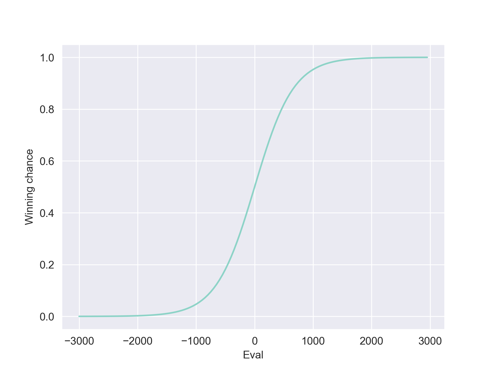

# Win Probabilities in chess using centipawns

## Intro

In this notebook I want to show how you can calculate the win probability of a chess player given the engone evaluation of the position. This was to reproduce the numbers in [this](https://lichess.org/page/accuracy) post. Converting an engine evaluation to a winning chance is useful because it considers how effective humans convert a position compared to an engine.

Lichess calculates the winning chances using a logistic regression. The winning chance of the White player is calculated as $p(white\ win) = 50 + 50 * (2 / (1 + e ^ {(-0.00368208\ *\ centipawns)}) - 1)$.

The blogpost claims the exponent is based on real game data. So I downloaded a bunch of pro games and decided to try to reproduce this number. I analyzed over 1000 games with Stockfish and calculated an exponent of $0.0030087$ to solve the logistic regression.

## Methods

The games were parsed and each position fen written in to a database. I then used [Stockfish 15](https://stockfishchess.org/) to evaluate the positions. As search limit was set to three million nodes. This is more than the Lichess server analysis but still runs good on a normal PC. I also saved the Elo of both players and move numbers.

For the next step I used [scikit-learn](https://scikit-learn.org/stable/index.html). All samples were weighted such that each game has the same effect on the result. To fit the logistic regression I used the `LogisticRegressionCV` module of scikit-learn which uses cross validation to find the best hyperparameters.

## Results

The results are pretty interesting. I got an exponent of $w = 0.0030087$ which is close to the hypothsis. With this setting we have an accuracy of $0.676$.

Using different hyperparameters yields highly varying  results. The most important hyperparameter seem sto be the regularization strength. A low regularization ($10$) gives results close to the expected value. A high regularization ($0.0001$)[^1] gives a coefficient as low as $w = 0.000124$. The accuracy is still $0.676$.

Using the elo difference of both players can increase the accuracy to $0.721$.

## Possible Enhancements

It is easy to extend this model to use more features or to predict win/draw/loss chances instead of only win/loss chances.

## Data

I analyzed games from the [Lichess Elite Database](https://database.nikonoel.fr/) from April 2022.

[^1] The parameters is the inverse of the regularization strength.
